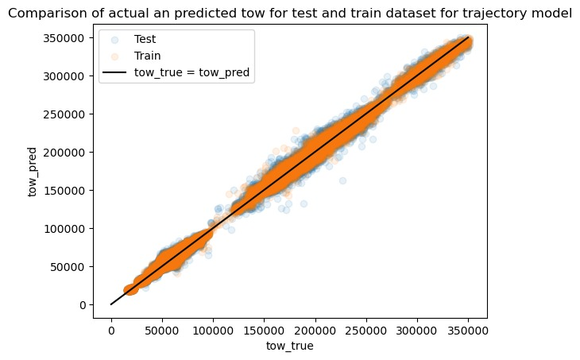

# PRC Data Challenge

Contribution of Malte Cordts, Sabrina Kerz, and Dennis Schorn to the [PRC Data Challenge 2024](https://ansperformance.eu/study/data-challenge/).
This code falls under GNU GPLv3, see the license tab for the full license.

## Current rankings

Available [here](https://datacomp.opensky-network.org/api/rankings)

<!--result-start-->
| Rank | Team Name | RMSE | File Version |
| ---- | --------- | ---- | ------------ |
| 1 | team_likable_jelly | 1564.09 | v21 |
| 2 | team_tiny_rainbow | 2224.69 | v119 |
| 3 | team_brave_pillow | 2318.49 | v81 |
| 4 | team_delightful_avocado | 2355.61 | v16 |
| 5 | team_youthful_xerox | 2386.53 | v8 |
| 6 | team_affectionate_bridge | 2456.7 | v6 |
| 7 | team_honest_turtle | 2548.83 | v22 |
| 8 | team_mindful_donkey | 2683.05 | v9 |
| 9 | team_amazing_forest | 2695.6 | v18 |
| 10 | team_modest_scooter | 2696.67 | v6 |
| 11 | team_gentle_wreath | 2702.16 | v20 |
| 12 | team_exuberant_scooter | 2722.28 | v6 |
| 13 | team_elegant_lemon | 2746.3 | v26 |
| 14 | team_diligent_igloo | 2790.44 | v11 |
| 15 | team_patient_net | 2798.52 | v6 |
| 16 | team_exuberant_hippo | 2932.55 | v8 |
| 17 | team_faithful_engine | 2965.47 | v1 |
| 18 | team_loyal_hippo | 3029.57 | v10 |
| 19 | team_zealous_watermelon | 3043.05 | v0 |
| 20 | team_mellow_barn | 3176.4 | v7 |
| 21 | team_jolly_koala | 3255.99 | v28 |
| 22 | team_zesty_ostrich | 3380.77 | v6 |
| 23 | team_energetic_quiver | 3683.31 | v15 |
| 24 | **team_organized_volcano** | 3755.47 | v9 |
| 25 | team_faithful_napkin | 3810.9 | v0 |
| 26 | team_outspoken_engine | 3960.86 | v10 |
| 27 | team_respectful_kangaroo | 4052.19 | v5 |
| 28 | team_nice_hippo | 4263.82 | v7 |
| 29 | team_gentle_elephant | 4299.75 | v1 |
| 30 | team_joyful_zeppelin | 4845.14 | v3 |
| 31 | team_amiable_garden | 4988.93 | v13 |
| 32 | team_refreshing_unicorn | 6533.31 | v1 |
| 33 | team_versatile_yacht | 6713.85 | v18 |
| 34 | team_zippy_river | 6839.35 | v11 |
| 35 | team_nice_jacket | 9660.8 | v5 |
| 36 | team_nice_wolf | 13594.84 | v2 |
| 37 | team_dependable_gorilla | 95849.37 | v1 |
<!--result-end-->

## Our models

### base_model

### traj_model

## trajectories and kpi

## Notebooks
[Initial Data Review](https://colab.research.google.com/drive/1WMxJp5L7vl9GBKhZzXFJeXjvI1MgSNON#scrollTo=p6q00gZ2aoNO) 

[Flight List Based Model](https://colab.research.google.com/drive/1h_4Kw_Kx4-c8agqgn95yTxK5HRhB2JIF)

[Script for training and predicting the model](https://colab.research.google.com/drive/1mKO-b7YfdCXVuNLkEvr6OccVzr4FLsp0?usp=sharing)

## Documentation

[Flight List Based Model](https://docs.google.com/document/d/1--aCGaPIoykFuH6jPuZkSNKuL8PHXe96vltabt59e6Y/edit)

## Information
[Data Explanation](https://drive.google.com/file/d/1qJPLEoQPBFM8mL6tLpiV-vdHZd88V_wM/view?usp=drive_link) 

[Introduction Slides](https://drive.google.com/file/d/1aDVe83t2N_of7b_DXSE8yEuQ1MaV0RpH/view?usp=drive_link) 

## Goal
**We aim to hand in a solution before the final deadline!**

## Decisions & Plans
- We want to start with a simple model, using only the flight list
- Then iterate & improve it by adding handcrafted features
- Next include data from the actual trajectories, without temporal features
- Then move to more complex models if necessary, eventually ending up with a transformer
- Optimise for RMSE, since this is used in the final scoring of our submission

# Model Features Overview
## FightList
This table lists all the features in the flightlist and indicates whether each feature is used in the models.

### Raw Features
| Feature          | 1. HGBR Model |
| ---------------------------------------- | ------- |
| flight_id (unique ID)                    | ❌      |
| callsign (obfuscated callsign)           | ❌      |
| adep (Aerodrome of DEParture)            | ❌      |
| ades (Aerodrome of DEStination)          | ❌      |
| name_adep (ADEP airport name)            | ❌      |
| name_ades (ADES airport name)            | ❌      |
| country_code_adep (ADEP country code)    | ✅      |
| country_code_ades (ADES country code)    | ✅      |
| date (date of flight)                    | ❌      |
| actual_offblock_time (AOBT)              | ❌      |
| arrival_time (ARVT)                      | ❌      |
| aircraft_type (aircraft type code)       | ✅      |
| wtc (Wake Turbulence Category)           | ✅      |
| airline (Aircraft Operator code)         | ✅      |
| flight_duration (flight duration in mins)| ✅      |
| taxiout_time (taxi-out time in mins)     | ✅      |
| flown_distance (route length in nmi)     | ✅      |

### Engineered Features
| Feature                                  | 2. HGBR Model |
| ---------------------------------------- | ------- |
|weekday                                 | ✅      |
| year sin                                | ✅      |
| arrival day sin                         | ✅      |
| start_hour                              | ✅      |

## Trajectories

### Engineered Features
| Feature                                  | 3. HGBR Model |
| ---------------------------------------- | ------- |
|Average climb rate, 1st flight phase   | ✅      |
|Average climb rate, 3rd flight phase    | ✅     |
|Average altitude, 2nd flight phase    | ✅     |

### Versions

Since the trajectory data was updated during the project phase, we downloaded and processed the data multiple times. The first few versions (0-6) were testing different aspects of the model on the early data. 
From 7 onwards we worked with the final data (submission_set + final_submission_set).
All trajectories were re-downloaded and processed after version 8. New features from trajectories were extracted after version 12.

7. kpi > 0.8 traj_model, rest base_model on rest of data
8. kpi > 0.8 traj model, rest base_model on all data
9. all base_model
10. all base_model, sorted by index (to test if the order of the data matters in the submission)
11. kpi > 0.8 traj model, rest base_model on all data, sorted by index
12. traj model only on tow > 250t and kpi > 0.8, rest base
13. traj model with new trajectories traj model only on tow > 250t and kpi > 0.8, rest base
14. traj model with custom weights that equal the kpi of each flight
15. traj model with new trajectories traj model only on tow > 250t and kpi > 0.0, rest base

### Our submissions
| File Version | RMSE    |
|--------------|---------|
| v6           | 9959.47 |
| v7           | 9950.77 |
| v8           | 10106.12|
| v9           | 3755.47 |
| v10          | 3755.47 |
| v11          | 10106.12|
| v12          | 4341.19 |
| v13          | 4023.11 |
| v14          | 4525.74 |

Our models continued to display better RMSE for our train and test data, but the performance did not improve as expected on the actual submission set. 

We suspect part of the problem to be the actual distribution of the data. We found no flights over 250t in the data that we initially used for training our traj_model, while flights with over 250t appeared in the final_submission_set. Using the traj_model only on flights below a base_model prediction of 250t was tested (v12 and later) but the improvement form this was still smaller than just using the base_model.

For kpi=0 it looks like the traj_model does not overfit on our data: 

#### We were unable to fully determine why our models performed worse than expected on the final data set.

## License

This project is licensed under the GNU General Public License v3.0 - see the [LICENSE](./LICENSE) file for details.
